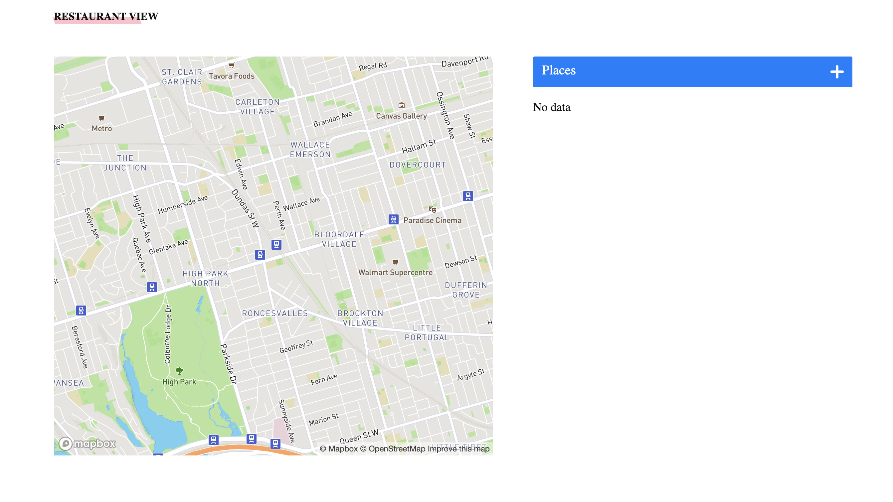

# Restaurant Review Site

## Demo Link

Here is a live working solution of the application: [test-link](google.com)

## Table Of Content

- [About the app](#about-the-app)
- [Screenshots](#screenshots)
- [Technologies](#technologies)
- [Setup](#setup)
- [Approach](#approach)
- [Status](#status)
- [Credits](#credits)
- [License](#licence)

## About the app

## Screenshots

## Technologies

- React
- Sass
- Mapbox

## Setup

- clone the project from github
-

## Approach

I started this project by reading through the project's brief.

After understanding the requirements of the project, I sketched the layout and flow of the application.

Next, I jumped into figma to implement my the sketch and came up with a prototype of how the end product should look.

Using React library, I implemented the prototype as well as integrated a third-party library such as Mapbox for rendering locations on the map.

`Design Pattern and Architecture`

- `Folder Structure`: I used the 7-in-one folder structure achictecture to organise files and folders to ensure easy access and navigation within the project as well as set standards for future modifications.

- `Naming conventions`: Followed the BEM guidelines for naming my css class.

## Status

In progress

## Credits

[OpenClassrooms](https://openclassrooms.com/en/)

## License

2020 @ [victorbruce](https://victorbruce.tech)
